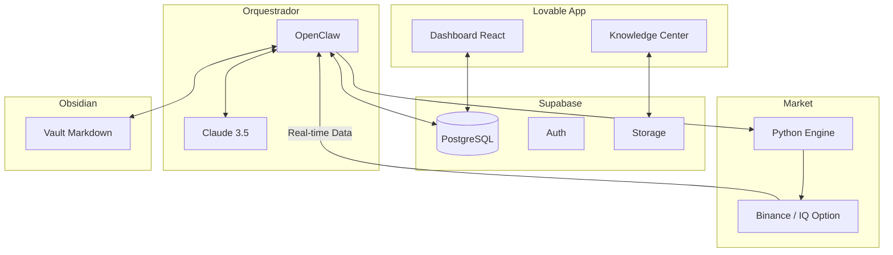

# Nexus Trader: Blueprint de Arquitetura e Tecnologias

Este documento detalha a arquitetura completa da plataforma Nexus Trader, integrando frontend moderno, backend escalável, orquestração de IA e memória persistente.

## 1. Stack Tecnológica Geral

| Camada | Tecnologia | Função |
| :--- | :--- | :--- |
| **Frontend** | React + Tailwind CSS + Vite (Lovable) | Interface do usuário, dashboards e controles. |
| **Backend / BaaS** | Supabase (PostgreSQL, Auth, Storage) | Banco de dados, autenticação e armazenamento de arquivos. |
| **Orquestrador de IA** | OpenClaw | Coordenação de agentes, execução de tarefas e automação. |
| **Cérebro de IA** | Claude 3.5 Sonnet / Opus (Anthropic) | Análise de mercado, tomada de decisão e geração de know-how. |
| **Memória Persistente** | Obsidian (Markdown) | Base de conhecimento, logs de operação e insights de longo prazo. |
| **Execução de Trading** | Python (APIs Binance / IQ Option) | Conectividade com o mercado financeiro. |

## 2. Arquitetura de Dados (Supabase)

O Supabase atuará como o hub central de dados estruturados.

### 2.1. Tabelas do Banco de Dados (PostgreSQL)
*   **`profiles`:** Dados do usuário, chaves de API criptografadas e preferências.
*   **`trades`:** Registro de cada operação (Ativo, Preço, Resultado, Estratégia usada).
*   **`ai_logs`:** Histórico de "pensamentos" e análises do Claude.
*   **`bankroll_history`:** Evolução do saldo para alimentar os gráficos do frontend.
*   **`knowledge_base_meta`:** Metadados das notas do Obsidian para sincronização com o frontend.

### 2.2. Supabase Storage (Buckets)
*   **`context-uploads`:** Armazenamento de PDFs e documentos enviados pelo usuário para injeção de contexto.
*   **`obsidian-sync`:** (Opcional) Backup das notas do Obsidian para acesso via web.

## 3. Fluxo de Operação e Orquestração

## 4. Integração Frontend e Backend

1.  **Sincronização em Tempo Real:** O Lovable usará as **Realtime Subscriptions** do Supabase para atualizar os gráficos e o terminal de logs assim que o OpenClaw inserir um novo registro no banco.
2.  **Injeção de Contexto:** Quando você faz upload de um arquivo na "Central de Memória", o arquivo vai para o **Supabase Storage**. O OpenClaw detecta o novo arquivo, envia para o Claude analisar e salva o insight no **Obsidian**.
3.  **Controle de Operação:** Ao clicar em "Iniciar Automação" no Lovable, uma **Edge Function** no Supabase é disparada, enviando um sinal para o **OpenClaw** iniciar o loop de trading.

## 5. Segurança e Gerenciamento de Risco

*   **Criptografia de Chaves:** As chaves de API das corretoras serão armazenadas no Supabase usando criptografia de nível de banco de dados (Vault).
*   **Kill Switch:** Um comando de emergência no frontend que o OpenClaw prioriza para fechar todas as ordens abertas instantaneamente.
*   **Rate Limiting:** O OpenClaw gerenciará as chamadas à API do Claude e das corretoras para evitar bloqueios.

## 6. Próximos Passos de Desenvolvimento

1.  **Setup do Supabase:** Criar o projeto e definir o schema das tabelas mencionadas.
2.  **Configuração do OpenClaw:** Instalar o orquestrador em um servidor (ex: VPS ou Docker) e conectar ao Supabase via Webhooks.
3.  **Desenvolvimento dos Skills de Trading:** Criar os scripts Python para execução de ordens e coleta de dados via WebSocket.
4.  **Conexão Lovable + Supabase:** Configurar o frontend para ler/escrever dados reais no backend.

---
Este ecossistema garante que você tenha uma plataforma **profissional** (pela robustez do Supabase), **inteligente** (pelo Claude), **autônoma** (pelo OpenClaw) e com **memória evolutiva** (pelo Obsidian).
